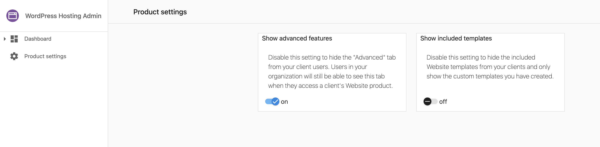
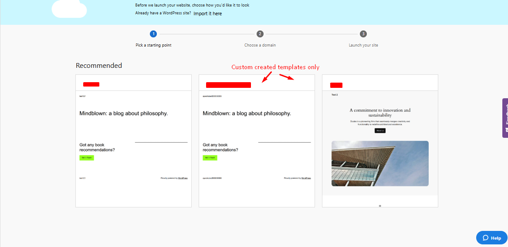

# Hide Vendasta's Pre-built Templates from Clients

To prevent your clients from accessing the pre-built templates included in the initial WordPress Hosting setup, follow these simple steps:

## Configuration Steps

1. Go to the **Product Info** tab
2. Click on **Admin Tools**
3. Select **Product Settings**

Within the **Product Settings** section, you'll see an option labeled **Show Included Templates**. Toggle this setting off to hide the default pre-built templates from your clients. Disabling this option ensures that clients will no longer see or have access to these templates.

## Visual Guide

**When the included Website templates are enabled:**

**When the included Website templates are disabled:**

## Impact

When this setting is disabled:
- Clients will not see Vendasta's pre-built templates
- Clients can still upload their own custom templates
- The template selection interface becomes cleaner and more focused
- Partners maintain control over the client experience