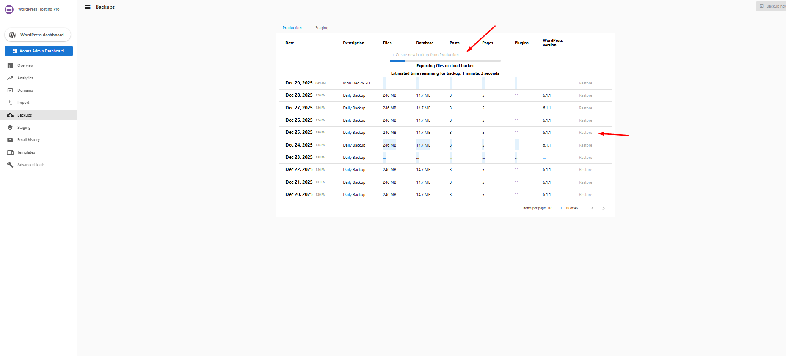

# Backup Best Practices: Do’s and Don’ts

Creating backups is a critical step in protecting your WordPress website. While the backup system is designed to be reliable and user-friendly, following best practices helps ensure backups complete successfully and can be restored when needed.

This guide outlines what you **should** and **should not** do while creating backups.

---

## ✅ Do’s: Recommended Best Practices

### ✅ Create Backups Before Major Changes
Always create a manual backup before:
- Updating WordPress core
- Updating plugins or themes
- Making design or layout changes
- Troubleshooting site issues

This ensures you have a safe restore point if something goes wrong.

---

### ✅ Allow Backups to Complete Fully
Once a backup is started, allow it to complete without interruption.

- The UI will display progress indicators such as **“Exporting files to cloud bucket”**
- Backup duration depends on site size and content

⏱️ **Note:**  
Large websites (especially **50 GB or more**) may take longer than usual to generate a backup.

---

### ✅ Monitor Backup Status from the Dashboard
You can track:
- File size
- Database size
- WordPress version
- Date and time of the backup

Once completed, the backup will appear in the list with a **Restore** option.

---

### ✅ Contact Support If a Backup Appears Stuck
If a backup appears to be running significantly longer than expected or does not progress:

- Wait a reasonable amount of time, especially for large sites
- If the backup still appears stuck, reach out to **Live Chat Support**

Our team can investigate and resolve the issue at the earliest.

---

## ❌ Don’ts: What to Avoid

### ❌ Do Not Attempt to Force Multiple Backups
Do not try to trigger another backup while one is already in progress.

- The UI **does not allow** starting a second backup during an active backup
- Refreshing or force-clicking will not speed up the process

This is an intentional safeguard to prevent data corruption or incomplete backups.

---

### ❌ Do Not Refresh or Navigate Excessively During Backup
While a backup is running:
- Avoid repeatedly refreshing the page
- Avoid switching environments unnecessarily

Doing so may cause confusion about backup status, even though the process continues server-side.

---

### ❌ Do Not Assume Staging Has Automated Backups
Staging sites:
- Do **not** receive automated daily backups
- Require **manual backups only**

Always create a manual backup before testing changes in staging.

---

### ❌ Do Not Rely on Backups as a Replacement for Testing
Backups are a recovery tool—not a substitute for proper testing.

- Test changes in staging where possible
- Validate updates before applying them to production

---

## Backup Duration Expectations

| Site Size | Expected Backup Time |
|---------|---------------------|
| Small (<5 GB) | A few minutes |
| Medium (5–20 GB) | Several minutes |
| Large (20–50 GB) | Longer processing time |
| Very Large (50+ GB) | May take significantly longer |

Actual duration may vary depending on content, media files, and database size.

---

## When to Contact Support

Reach out to **Live Chat Support** if:
- A backup shows no progress for an unusually long time
- A backup fails repeatedly
- The backup does not appear after completion
- You are unsure whether it is safe to restore

Our support team can review logs and assist promptly.

---

## Summary

Following these do’s and don’ts helps ensure:
- Reliable backup creation
- Faster recovery when needed
- Reduced risk of failed or incomplete backups

Taking a few extra moments to follow best practices can save significant time and effort later.