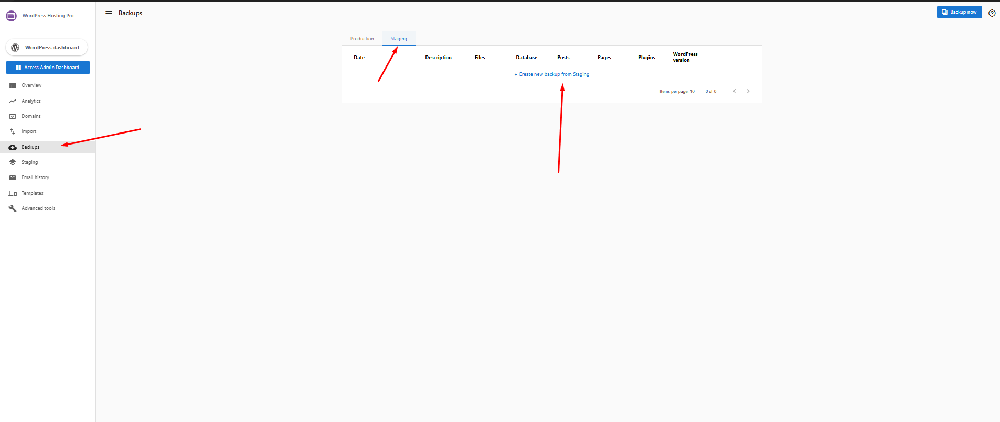

# Create a Backup from the Staging Environment

The **staging environment** is designed for testing changes safely before publishing them to your live site. To support this workflow, WordPress Hosting allows you to **manually create backups of your staging site**, giving you full control over saving and restoring work-in-progress changes.

This article explains **when**, **why**, and **how** to create a staging backup.

---

## Important: How Staging Backups Work

Before getting started, it’s important to understand how backups differ between **Production (Live)** and **Staging** environments.

- **Production (Live) Sites**
  - Receive **automatic daily backups**
  - Manual backups are also supported

- **Staging Sites**
  - ❌ **Do not receive automatic backups**
  - ✅ **Backups must be created manually**

👉 If you want a restore point for your staging work, you must create it yourself.

---

## Why Create a Staging Backup?

Creating a backup of your staging site is recommended when you are:

- Testing new themes or plugins
- Making major design changes
- Updating WordPress core or PHP versions
- Preparing a staging site to be restored later
- Safeguarding progress before syncing to production

A staging backup ensures you can quickly roll back if something doesn’t work as expected.

---

## How to Create a Backup from the Staging Environment

You can create a staging backup at any time directly from your site dashboard.

### Step-by-Step Instructions

1. Log in to your **WordPress Hosting dashboard**.
2. Navigate to the **Backups** tab.
3. At the top of the page, switch from **Production** to **Staging**.
4. Click **Create new backup for Staging**.
5. Wait for the backup process to complete.

Once finished, the new backup will appear in the **Staging backups list** and can be used as a restore point.

> `

---

## What’s Included in a Staging Backup?

A staging backup captures the full state of your staging site, including:

- Website files
- Database content
- Plugins and themes
- Pages and posts
- WordPress version at the time of backup

This ensures a complete recovery point for your staging environment.

---

## Best Practices for Staging Backups

- Create a backup **before major changes**
- Avoid starting multiple backups at the same time
- Allow sufficient time for large sites to complete backups
- Regularly clean unused plugins and data to reduce backup size

> ℹ️ **Note:** Large sites (especially those over 50 GB) may take longer to generate a backup.

---

## Need Help?

If a staging backup appears **stuck longer than usual** or fails to complete:

- Do **not** attempt to force another backup
- Reach out to our team via the **Live Chat support option**
- Our support team can quickly investigate and resolve the issue

---

Creating staging backups gives you confidence to experiment, test, and refine your site without risk. Make it part of your workflow to ensure smooth development and easy recovery.
