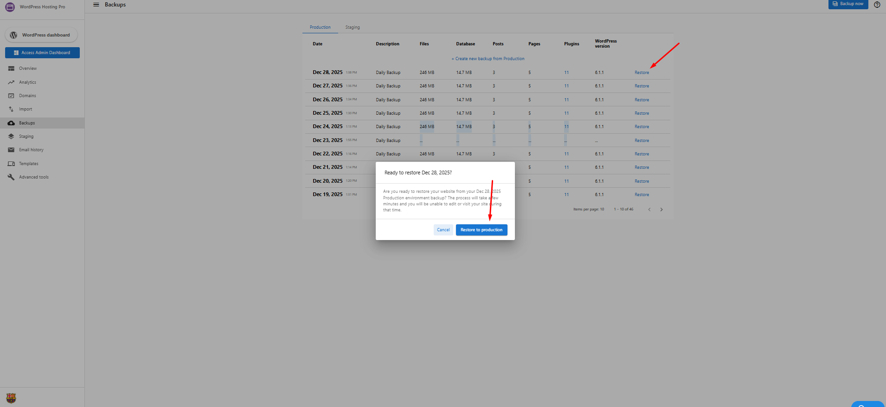

# Managing and Creating Website Backups

Backups are essential for protecting your website against data loss, failed updates, or accidental changes. WordPress Hosting includes a reliable backup system that allows you to restore your site quickly and confidently when needed.

This guide explains how backups work, how long they’re retained, how to create and restore backups, and best practices for protecting both live and staging sites.

---

## Backup System Overview

WordPress Hosting uses a **two-layer backup system** designed for both convenience and control:

- **Automated daily backups** for live (production) sites  
- **Manual, on-demand backups** for live and staging sites  

This ensures you always have a recovery point available—whether you’re performing routine maintenance or making major updates.

---

## Automated Daily Backups

Automated backups are enabled by default for live websites.

### What’s Included
- A backup of your **production site is created once every day**
- No manual action is required
- Captures recent content, configuration changes, and updates

Automated backups provide a dependable safety net for unexpected issues such as failed plugin updates or site errors.

---

## Manual (On-Demand) Backups

Manual backups allow you to create a backup at any time.

### When to Use Manual Backups
- Before updating plugins or themes  
- Prior to design or layout changes  
- Before troubleshooting or testing fixes  
- When working in a staging environment  

Manual backups give you immediate control and peace of mind before making changes.

---

## Backup Retention by Hosting Plan

Backup retention varies depending on your WordPress Hosting tier.

### WordPress Hosting Pro
- Backups retained for **up to 60 days**
- Ideal for agencies, developers, and advanced workflows
- Provides access to a longer restore history

### WordPress Hosting Standard
- Backups retained for **1 day**
- Provides essential protection for basic site recovery

Backups older than the retention window are automatically removed.

---

## Live Site vs. Staging Site Backups

Understanding how backups differ between environments is important.

### Live (Production) Sites
- Receive **automated daily backups**
- Support **manual backups** at any time

### Staging Sites
- **Do not receive automated backups**
- Require **manual backups only**

If you’re testing changes in staging, be sure to create a manual backup first.

---

## How to Create a Manual Backup

### Production (Live) Site

1. Open your site dashboard.
2. Navigate to the **Backups** tab.
3. Ensure **Production** is selected.
4. Click **Create a new backup from Production** or **Backup Now**.

Once started, the system captures the current state of your live site. The new backup will appear in the list once complete.

---

### Staging Site

1. Go to the **Backups** tab.
2. Switch to the **Staging** view.
3. Click **Create new backup for staging**.

Staging backups must always be created manually.

---

## How to Restore a Backup

Restoring a backup allows you to revert your site to a previous working state.

### Steps to Restore a Backup

1. Open the **Backups** tab in your site dashboard.
2. Locate the backup you want to restore.
3. Click **Restore** next to the selected backup.
4. Confirm the restore action when prompted.

⚠️ **Important:**  
Restoring a backup will overwrite your current site data. Any changes made after the backup was created will be lost.

---

## Best Practices for Managing Backups

- Create a **manual backup before major updates or changes**
- Always back up your **staging site manually**
- Be mindful of **retention limits**, especially on Standard plans
- Use backups as part of a regular maintenance workflow
- Avoid relying on backups as a substitute for proper testing

---

## Summary: Backup Capabilities by Plan

| Feature | Standard | Pro |
|------|--------|-----|
| Automated Daily Backups | ✅ | ✅ |
| Manual Backups | ✅ | ✅ |
| Staging Backups | Manual only | Manual only |
| Backup Retention | 1 day | Up to 60 days |
| Restore Capability | ✅ | ✅ |

---

Using automated and manual backups together ensures your website remains protected, recoverable, and ready for change—whether you’re running a simple business site or managing multiple client projects.