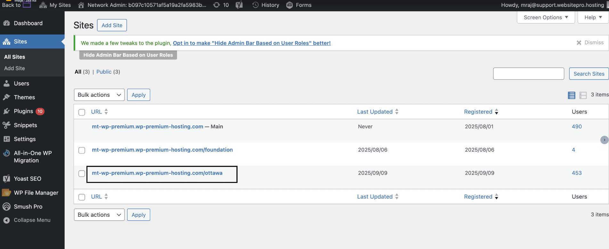
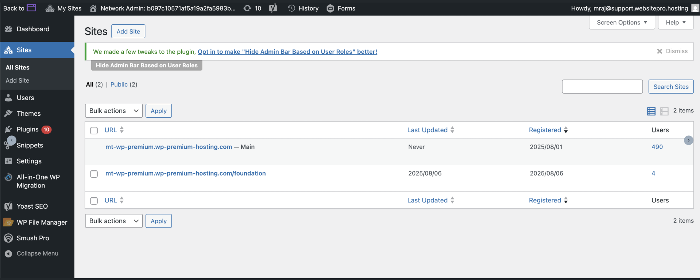
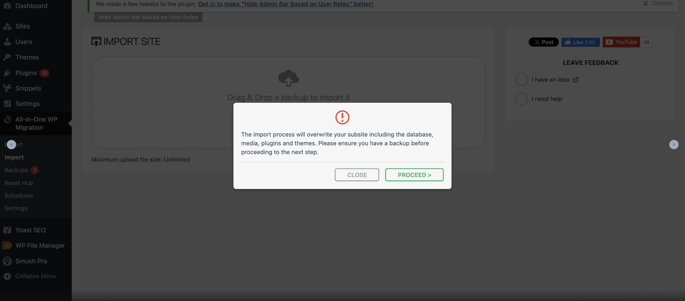
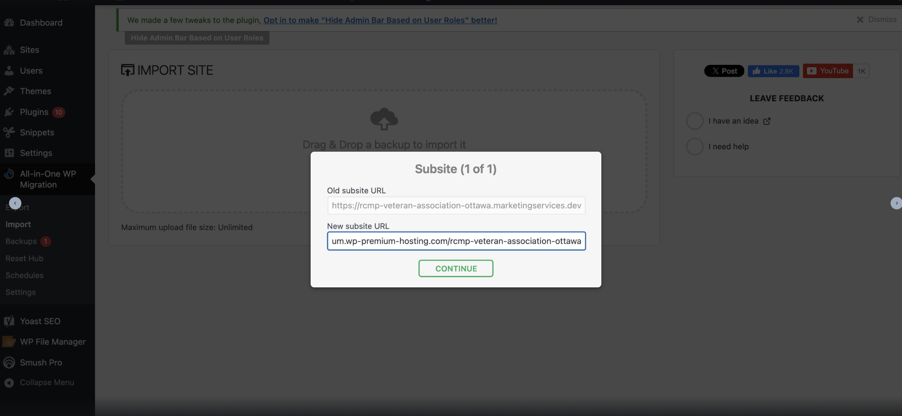

# Import a Single Site into Multisite Using All-in-One Migration

This guide explains how to import an existing **single WordPress site** into a **WordPress Multisite network** using the **All-in-One WP Migration** plugin.

---

## Before You Begin

- Ensure **WordPress Multisite** is already enabled.
- Take a **full backup** of your multisite network.
- Do **not** manually create the subsite you plan to import.

---

## Step 1: Check for Existing Subsite Conflicts

Before importing, verify that a subsite with the same name does **not** already exist.

- If a subsite with the same name exists (even if empty), **delete it first**
- This prevents naming conflicts during the import
- Let the import process create the subsite automatically

**Example:**  
If you want to import a site as `ottawa`, do **not** create the `ottawa` subsite manually.

> 

---

## Step 2: Install Required Plugins

Install the following plugins on the **network admin** dashboard:

- **All-in-One WP Migration**
- Required add-ons:
  - **All-in-One WP Migration Multisite Extension**
  - **All-in-One WP Migration Unlimited Extension**

---

## Step 3: Import the Single Site

1. Open **Network Admin → Sites**
2. Go to **All-in-One WP Migration → Import**
3. Upload or select the backup file of the single site
4. Wait for the import process to complete
> 

---

## Step 4: Confirm the Overwrite Warning

Once the import finishes, you’ll see a confirmation popup stating:

> *“The import process will overwrite your subsite including the database, media, plugins, and themes. Please ensure you have a backup before proceeding to the next step.”*

- Review the warning
- Click **Proceed** to continue

> 
---

## Step 5: Set the Subsite URL

You’ll be prompted to define the subsite URL:

- Enter the subsite name (slug)
- The URL will be generated automatically based on your network configuration

**Example:**  
If the subsite name is `ottawa`, the URL will reflect that path or domain.

- Click **Continue** to finalize the import

> 

---

## Step 6: Verify the Imported Site

After the import is complete:

- Navigate to **Network Admin → Sites**
- Open the newly created subsite
- Verify:
  - Pages and posts
  - Media files
  - Plugins and themes
  - Site functionality

---

## Important Notes

- The import **overwrites all data** for the target subsite
- Always keep a backup before importing
- Large sites may take longer to import depending on size

---

## Summary

- Do not create the subsite manually before import
- Use All-in-One WP Migration with required extensions
- Confirm overwrite warnings carefully
- Set the subsite URL during the final step
- Verify the site after import

If you encounter issues during import, review plugin logs or restore from backup before retrying.
