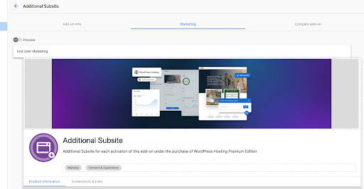
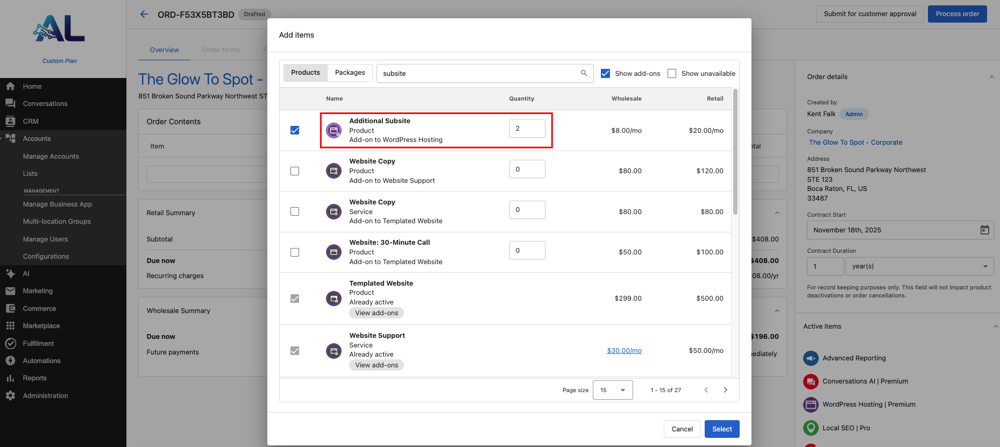
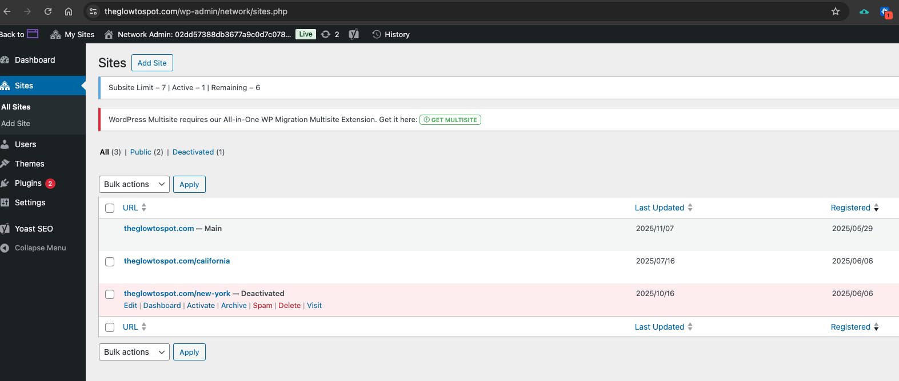
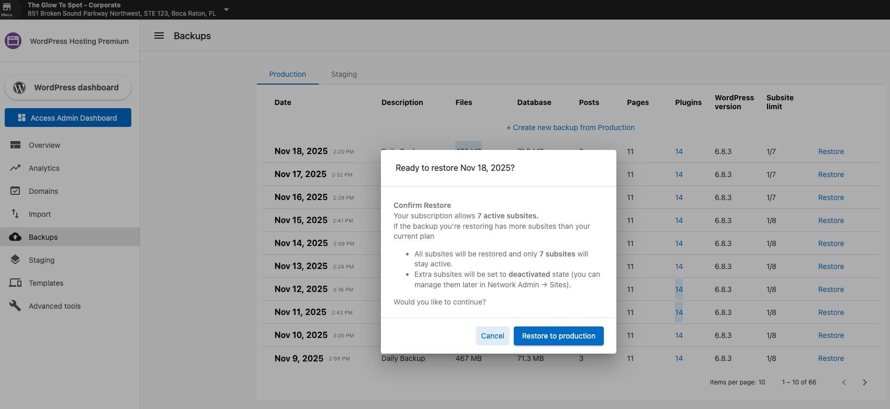
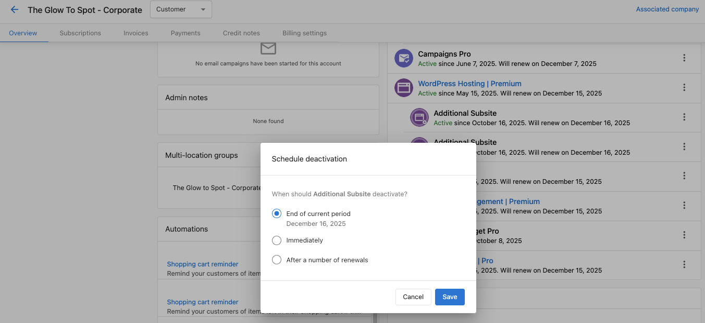

The **Additional Subsites Add-on** gives you flexible control to grow your WordPress multisite network with ease. With this add-on, you can expand your **WordPress Hosting Premium** plan beyond the default **1 Primary + 5 Subsites**, allowing you to scale as your organization grows.

Ideal for **agencies, franchises, and multi-location brands**, the add-on makes it simple to increase capacity, manage subsites safely, and maintain strong performance — all with full visibility in both the Partner Center and your WordPress dashboards.

---

### Key Benefits

* **Scale easily** — Add extra subsites as your network grows.  
* **On-demand flexibility** — Purchase only what you need.  
* **Full visibility** — View your total and active subsite limits in both the Partner Center and WordPress dashboard.  
* **Safe management** — Deactivate subsites temporarily without losing data.  
* **Seamless backups** — Restores automatically respect subsite limits.  

---

### Default Setup

By default, **WordPress Hosting Premium** includes:

* 1 Primary Site + 5 Subsites  
* Shared themes, plugins, and branding  
* Centralized control from one WordPress network dashboard  

---

### How to Add More Subsites

You can enable the Add-on in two ways:
1. **For existing accounts**
   * In **Partner Center → Accounts → Create Order**
   * Add **Additional Subsites** to your Premium hosting plan

2. **For new accounts**
   * Selecting “Additional Subsites” automatically includes WordPress Hosting Premium

---

### Managing Subsites

In **WordPress Dashboard → Network Admin → Sites**, you can:

* View all **Active** and **Deactivated** subsites  
* Restore deactivated subsites anytime  
* Keep total active subsites within your purchased limit  

---

### Backup and Restore

* If a backup contains more subsites than your limit, extra subsites are restored in **Deactivated** mode.  
* The same rule applies when restoring from staging.  

---

### Deactivation and Downgrade

When you remove or downgrade the Add-on:
* **End of billing period** — stays active until renewal.  
* **Immediate deactivation** — subsite limit drops right away; extra subsites become *Deactivated*.  

---

### FAQs

**Q: How can I add more subsites?**  
Partners can activate the add-on from Partner Center when creating or updating an order under WordPress Hosting Premium.

**Q: Can I deactivate or restore subsites later?**  
Yes. You can safely deactivate subsites and restore them when needed, as long as your plan’s subsite limit allows it.

**Q: What happens if I downgrade or cancel the add-on?**  
Subsites that exceed your new limit will automatically move to a “Deactivated” state but can be reactivated later if you increase capacity again.

